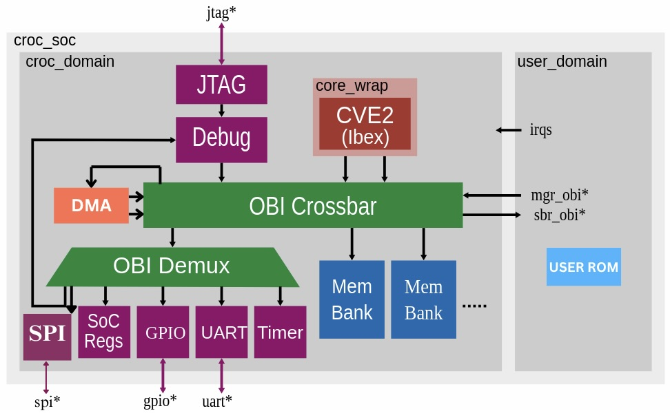

# RIVER
## Based on the Croc System-On-Chip

This repository was forked from the Croc repository from ETH: [Original GitHub](https://github.com/pulp-platform/croc)

As part of the VLSI2 course, it was extended to also include a DMA and an SPI peripheral. You can find the final report in the repository as well as a PDF.

The name RIVER comes from the fact, that we greatly improved the chip's streaming capabilities: Streaming -> Stream -> River (A strong stream).

## Architecture



The base `croc_domain` contained only a CVE2 core (a fork of Ibex), SRAM, an OBI crossbar and a few simple peripherals. We extended the design by adding a DMA and an SPI peripheral.

The main interconnect is OBI, you can find [the spec online](https://github.com/openhwgroup/obi/blob/072d9173c1f2d79471d6f2a10eae59ee387d4c6f/OBI-v1.6.0.pdf). 

The various IPs of the SoC (UART, OBI, debug-module, timer...) come from other PULP repositories and are managed by [Bender](https://github.com/pulp-platform/bender).

## Memory Map

The address map of the default configuration is as follows:

| Start Address   | Stop Address    | Description                                |
|-----------------|-----------------|--------------------------------------------|
| `32'h0000_0000` | `32'h0004_0000` | Debug module (JTAG)                        |
| `32'h0300_0000` | `32'h0300_1000` | SoC control/info registers                 |
| `32'h0300_2000` | `32'h0300_3000` | UART peripheral                            |
| `32'h0300_5000` | `32'h0300_6000` | GPIO peripheral                            |
| `32'h0300_A000` | `32'h0300_B000` | Timer peripheral                           |
| `32'h0300_C000` | `32'h0300_D000` | SPI peripheral                           	 |
| `32'h1000_0000` | `+SRAM_SIZE`    | Memory banks (SRAM)                        |
| `32'h2000_0000` | `32'h5000_0000` | Passthrough to user domain                 |
| `32'h2000_0000` | `32'h2000_1000` | USER ROM								     |
| `32'h5000_A000` | `32'h5000_1000` | DMA			                             |

## Flow

1. Bender provides a list of SystemVerilog files
2. Yosys parses, elaborates, optimizes and maps the design to the technology cells
3. The netlist, constraints and floorplan are loaded into OpenRoad for Place&Route
4. The design as def is read by klayout and the geometry of the cells and macros are merged

Currently, the final GDS is still missing the following things:
- metal density fill
- sealring
These can be added in KLayout, check the [IHP repository](https://github.com/IHP-GmbH/IHP-Open-PDK/tree/main) (possible the dev branch) for a reference script.


## Simulation
The SoC is fully functional as-is and our final demo is provided for simulation.

To compile the software, execute the following two commands:

3. oseda make -B sw (to compile software (sw/) to be run during simulation)
4. oseda make verilator	(functional simulation)

To write your own demo scripts, create a file in the "sw/demos/" folder. To use that script during
verilator, change the SW_HEX variable in the main makefile.

To run our input and output streaming demos, which utilize UART, please uncomment the defines at the very top of "rtl/tb_croc_soc.sv".

Right now the makefile is configured to run our final demo. To render the video, run:
oseda python python_files/render_demo.py

## Getting started
We re-wrote the synthesis, place and route scripts again from scratch, taking a lot of inspiration from the reference flow
and the course exercises.

### 0. Environment Setup

icdesign ihp13 -update all -nogui \
oseda -2025.07 make checkout

### 1. Development

1. Write RTL, testbench, and software.
2. Add all rtl source files to Bender (Bender.yml) under appropriate sections.


### 2. Synthesis (Yosys)

oceda make yosys-flist  
oceda make yosys

ℹ️ To preserve hierarchy for specific modules, add them to yosys/scripts/synthesis.tcl.

### 4. Physical Design (OpenROAD)

cd openroad  
oseda -2025.07 openroad scripts/S1_*  
oseda -2025.07 openroad scripts/S2_*  
oseda -2025.07 openroad scripts/S3_*  
oseda -2025.07 openroad scripts/S4_*

Execute scripts in order and review reports after each step!

Each script will open the gui at the end, for manuel inspection.

✅ Script S4 finishes the flow. S5 only opens a checkpoint for manuel analysis.

### 5. GDS Generation

./final2gds.sh

This prepares the design for DRC & LVS checks by creating the gds file and a spice netlist.


## Requirements
We are using the excellent docker container maintained by Harald Pretl. If you get stuck with installing the tools, we urge you to check the [Tool Repository](https://github.com/iic-jku/IIC-OSIC-TOOLS).  
The current supported version is 2025.03, no other version is officially supported.

### ETHZ systems
ETHZ Design Center maintains an internal version of the IHP PDK, with integrations into all tools we have access to. For this reason if you work on the ETH systems it is recommended to use the `icdesign` tool (cockpit) instead of the liked Github repo.  
You can directly create a cockpit directory inside the croc directory:
```sh
# Make sure you are in <somedir>/croc
# the checked-out repository
icdesign ihp13 -nogui
```
The setup is guided by the `.cockpitrc` configuration file. If you need different macros or another version of the standard cells you can change it accordingly.

An environment setup for bash is provided to get easy access to the tools:
```sh
source ethz.env
```

Additionally you may prefer to just enter a shell in the pre-installed osic-tools container using:
```sh
oseda bash
# older version eg: oseda -2025.03 bash
```

### Other systems
**Note: this has currently only been tested on Ubuntu and RHEL Linux.**

#### Docker (easy) 
There are two possible ways, the easiest way is to install docker and work in the docker container, you can follow the install guides on the [Docker Website](https://docs.docker.com/desktop/).  
You do not need to manually download the container image, this will be done when running the script.
If you do not have `git` installed on your system, you also need to install [Github Desktop](https://desktop.github.com/download/) and then clone this git repository.  

It is a good idea to grant non-root (`sudo`) users access to docker, this is decribed in the [Docker Article](https://docs.docker.com/engine/install/linux-postinstall/#manage-docker-as-a-non-root-user).

Finally, you can navigate to this directory, open a terminal (PowerShell in Windows) and type:
```sh
# Linux only (starts and enters docker container in shell)
./start_linux.sh
# Linux/Mac (starts VNC server on localhost:5901)
./start_vnc.sh
# Windows (starts VNC server on localhost:5901)
./start_vnc.bat
```

If you use the VNC option, open a browser and type `localhost` in the address bar. 
This should connect you to the VNC server, the password is `abc123`, then test by right-clicking somewhere, starting the terminal and typing `ls`.  
You should see the files in this repository again.

Now you should be in an Ubuntu environment with all tools pre-installed for you.  
If something does not work, refer to the upstream [IIC-OSIC-Tools](https://github.com/iic-jku/IIC-OSIC-TOOLS/tree/main)

#### Native install (hard)
You need to build/install the required tools manually:

- [Bender](https://github.com/pulp-platform/bender#installation): Dependency manager
- [Yosys](https://github.com/YosysHQ/yosys#building-from-source): Synthesis tool
- [Yosys-Slang](https://github.com/povik/yosys-slang): SystemVerilog frontend for Yosys
- [OpenRoad](https://github.com/The-OpenROAD-Project/OpenROAD/blob/master/docs/user/Build.md): Place & Route tool
- (Optional) [Verilator](https://github.com/verilator/verilator): Simulator
- (Optional) Questasim/Modelsim: Simulator


## Bender
The dependency manager [Bender](https://github.com/pulp-platform/bender) is used in most pulp-platform IPs.
Usually each dependency would be in a seperate repository, each with a `Bender.yml` file to describe where the RTL files are, how you can use this dependency and which additional dependency it has.
In the top level repository (like this SoC) you also have a `Bender.yml` file but you will commonly find a `Bender.lock` file. It contains the resolved tree of dependencies with specific commits for each. Whenever you run a command using Bender, this is the file it uses to figure out where things are.

Below is a small guide aimed at the usecase for this project. The Bender repo has a more extensive [Command Guide](https://github.com/pulp-platform/bender?tab=readme-ov-file#commands).

### Checkout
Using the command `bender checkout` Bender will check the lock file and download the specified commits from the repositories (usually into a hidden `.bender` directory). 

### Update
Running `bender update` on the other hand will resolve the entire tree again and re-generate the lock file (you usually have to resolve some version/revision conflicts if multiple things use the same dependency).

**Remember:** always test everything again if you generate a new `Bender.lock`, it is the same as modifying RTL.

### Local Versions
For this repository, we use a subcommand called `bendor vendor` together with the `vendor_package` section in `Bender.yml`.
`bendor vendor` can be used to Benderize arbitrary repositories with RTL in it. The dependencies are already 'checked out' into `rtl/<IP>`. Each file or directory from the repository is mapped to a local path in this repo.
Fixes and changes to each IPs `rtl/<IP>/Bender.yml` are managed by `bender vendor` in `rtl/patches`.

If you need to update a dependency or map another file you need to edit the coresponding `vendor_package` section in `Bender.yml` and then run `bender vendor init`. Then you might need to change `rtl/<IP>/Bender.yml` to list your new file in the sources. 
To save a fix/change as a patch, stage it in git and then run `bender vendor patch`. When prompted, add a commit message (this is used as the patches file name). Finally, commit both the patch file and the new `rtl/<IP>`.

**Note:** using `bender vendor` in this repository to change the local versions of the IPs requires an up-to-date version of Bender, specifically it needs to include [PR 179](https://github.com/pulp-platform/bender/pull/179).

### Targets
Another thing we use are targets (in the `Bender.yml`), together they build different views/contexts of your RTL. For example without defining any targets the technology independent cells/memories are used (in `rtl/tech_cells_generic/`) but if we use the target `ihp13` then the same modules contain a technology-specific implementation (in `ihp13/`). Similar contexts are built for different simulators and other things.

## License
Unless specified otherwise in the respective file headers, all code checked into this repository is made available under a permissive license. All hardware sources and tool scripts are licensed under the Solderpad Hardware License 0.51 (see `LICENSE.md`). All software sources are licensed under Apache 2.0.
